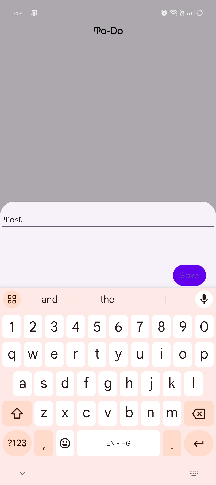
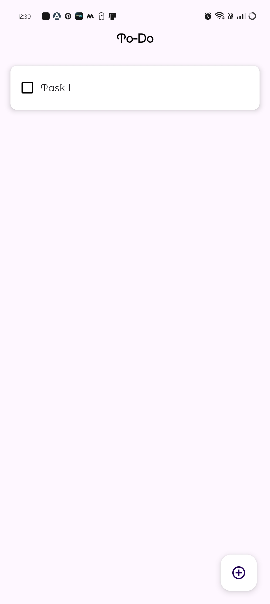
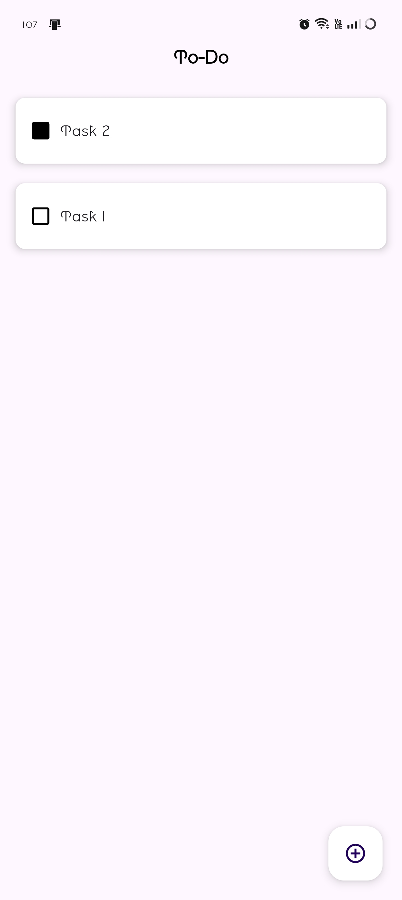
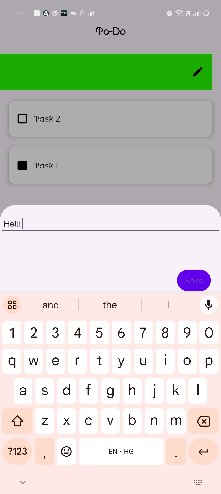
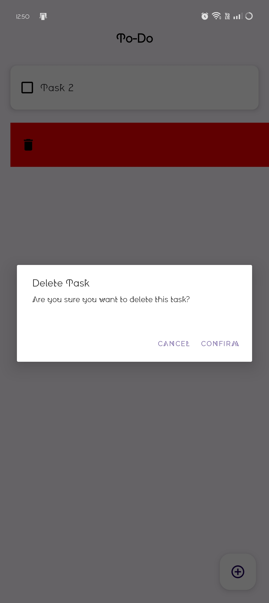

# ToDo List - Android Application

A simple and intuitive Android To-Do List application built with Java in Android Studio. This mini application helps users manage their daily tasks efficiently with a clean and user-friendly interface.

## About

This is a basic To-Do List application developed as a mini Android project to demonstrate fundamental Android development concepts using Java. The app offers essential task management functionality, focusing on simplicity and ease of use.

## Features

- **Add Tasks**: Create new tasks with ease
- **Mark Complete**: Check off completed tasks
- **Delete Tasks**: Remove tasks that are no longer needed
- **Clean UI**: Simple and intuitive user interface
- **Persistent Storage**: Tasks are saved locally on the device
- **Material Design**: Follows Android Material Design guidelines

## 🛠Built With

- **Language**: Java
- **IDE**: Android Studio
- **Framework**: Android SDK
- **Build System**: Gradle
- **UI**: XML Layouts with Material Design

## Screenshots

The application interface and functionality are showcased in the following screenshots:

| Screenshot 1 | Screenshot 2 | Screenshot 3 |
|:---:|:---:|:---:|
|  |  |  |

| Screenshot 4 | Screenshot 5 |
|:---:|:---:|
|  |  |

## Demo Video

Watch the application in action:


*Note: If the video doesn't play inline, you can download and view the [demo.mp4](assets/demo.mp4) file.*

## Getting Started

### Prerequisites

- Android Studio (latest version recommended)
- Android SDK
- Java Development Kit (JDK) 8 or higher
- Android device or emulator (API level 21+)

### Installation

1. **Clone the repository**
   ```bash
   git clone https://github.com/yourusername/Basic-Projects.git
   ```

2. **Open the project**
   - Launch Android Studio
   - Open the `TodoList` folder from the cloned repository

3. **Build the project**
   - Let Android Studio sync the project
   - Build the project using `Build > Make Project`

4. **Run the application**
   - Connect an Android device or start an emulator
   - Click the "Run" button or use `Shift + F10`

## APK Installation

A pre-built APK is available in the `app/build/outputs/apk/release/` directory:
- `To-Do.apk` - Ready to install on Android devices

To install:
1. Enable "Unknown Sources" in your Android device settings
2. Download and install the APK file
3. Launch the "To-Do" app from your app drawer

## Project Structure

```
TodoList/
├── app/
│   ├── src/
│   │   ├── main/
│   │   │   ├── java/          # Java source files
│   │   │   ├── res/           # Resources (layouts, values, etc.)
│   │   │   └── AndroidManifest.xml
│   │   ├── androidTest/       # Instrumented tests
│   │   └── test/              # Unit tests
│   ├── build.gradle.kts       # App-level build configuration
│   └── proguard-rules.pro     # ProGuard configuration
├── assets/                    # Screenshots and demo video
├── gradle/                    # Gradle wrapper files
├── build.gradle.kts          # Project-level build configuration
└── settings.gradle.kts       # Project settings
```

## Key Components

- **MainActivity**: Main activity handling the UI and user interactions
- **Task Adapter**: RecyclerView adapter for displaying tasks
- **Task Model**: Data model representing individual tasks
- **Database Helper**: SQLite database for local data persistence
- **Custom Layouts**: XML layouts for different screens and components

## Future Enhancements

- [ ] Task categories and labels
- [ ] Due date and time reminders
- [ ] Task priority levels
- [ ] Dark mode support
- [ ] Cloud synchronization
- [ ] Task sharing functionality
- [ ] Search and filter options

## Contributing

Contributions are welcome! Please feel free to submit a Pull Request.

## License

This project is open source and available under the MIT License.

## Contact

If you have any questions or suggestions, please don't hesitate to reach out.

---

*This project was created as a learning exercise in Android development with Java.*
